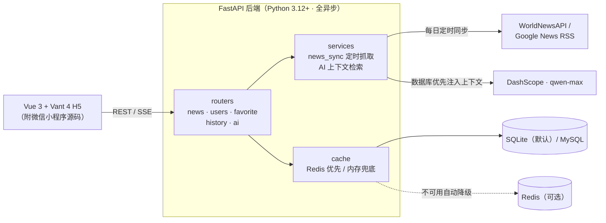

# AI 掘金头条新闻系统（Toutiao News）

     

仿今日头条的新闻资讯全栈项目：**FastAPI 异步后端 + Vue 3（Vant 4）移动端 H5 前端**（另附微信小程序源码），支持新闻自动抓取同步、发布管理、收藏、浏览历史与通义千问 AI 问答。

## 功能特性

- **新闻聚合**：通过 WorldNewsAPI / Google News RSS 每日定时抓取 9 大分类新闻（可手动触发），标题去重、正文抓取增强，多 feed 并发抓取
- **搜索与热榜**：站内搜索（标题/简介全库检索 + 分页）；真热榜（全库或分类按阅读量排序，数据库聚合），前端独立搜索页
- **用户系统**：注册、登录、头像上传、资料与密码修改（bcrypt 加密 + 数据库令牌认证，7 天有效期），登录/注册按 IP 限流防暴力破解
- **新闻发布**：登录用户可发布/编辑/删除自己的新闻，支持本地上传封面（≤5MB）
- **收藏与历史**：登录用户云端同步，未登录时前端本地兜底
- **AI 问答**：DashScope（qwen-max）流式问答代理，**数据库优先**——先检索站内新闻注入上下文（省额度、回答更有依据），未配置 Key 时直接用站内新闻兜底作答；带每 IP 限流；登录用户问答自动存历史（`ai_chat` 表），支持回看与删除；新闻详情页可一键"问 AI"
- **多级缓存**：Redis 优先、进程内存兜底（Redis 不可用时自动降级，无需强制部署）
- **接口测试**：pytest 端到端测试套件（用户/新闻/缓存失效/收藏历史/鉴权/限流）

## 系统架构



## 技术栈

| 层 | 技术 |
| --- | --- |
| 后端 | Python 3.12+、FastAPI、SQLAlchemy 2.0（异步）、Pydantic v2 |
| 数据库 | 默认 SQLite（aiosqlite），可切换 MySQL（aiomysql） |
| 缓存 | Redis（可选）+ 进程内存 TTL 兜底 |
| 前端 | Vue 3、Vite 7、Pinia、Vue Router、Vant 4、vue-i18n、marked + DOMPurify |
| AI | 阿里云 DashScope OpenAI 兼容接口（qwen-max，SSE 流式） |

## 项目结构

```
今日头条日更/
├── fastApiProject/                # FastAPI 后端
│   ├── main.py                    # 应用入口（CORS、启动时建库、后台同步任务）
│   ├── config/                    # 数据库、缓存连接配置
│   ├── models/                    # ORM 模型（user/user_token/news_category/news/favorite/history）
│   ├── schemas/                   # Pydantic 请求/响应模型
│   ├── crud/                      # 数据访问层
│   ├── routers/                   # 路由：news / users / favorite / history / ai
│   ├── services/                  # 新闻同步（news_sync）、正文增强（news_detail_enrichment）
│   ├── cache/                     # 缓存 key 封装（列表/详情/相关新闻/分类）
│   ├── utils/                     # 认证、加密、统一响应、异常处理
│   ├── uploads/                   # 头像与新闻封面存储
│   └── .env                       # 环境变量（含密钥，勿提交）
├── 03-前端项目代码/xwzx-news/      # Vue 3 H5 前端
│   └── src/
│       ├── services/request.js    # 统一 axios 实例（自动携带 token、401 统一登出）
│       ├── store/                 # Pinia（持久化登录态、收藏、历史）
│       ├── views/                 # 15 个页面（首页/详情/发布/热榜/搜索/AI 问答等）
│       └── router/                # 路由 + 登录守卫
├── database.sql                   # MySQL 建库脚本（可选，默认走 ORM 自动建表）
├── docker-compose.yml             # backend + redis 一键编排
└── start-all.ps1 / 一键启动.bat    # Windows 本地一键启动
```

## 快速开始

### 方式一：Windows 一键启动（开发）

```powershell
# 或直接双击 一键启动.bat
powershell -ExecutionPolicy Bypass -File start-all.ps1
```

自动创建虚拟环境/安装依赖/安装前端依赖，并分别在 8000（后端）与 5173（前端）端口启动，浏览器自动打开 `http://127.0.0.1:5173`；缺失 `fastApiProject\.env` 时会自动从 `.env.example` 生成（需自行填入 API Key），8000/5173 端口被占用时会提前警告。

### 方式二：手动启动

```bash
# 后端（fastApiProject 目录下）
python -m venv .venv
.venv\Scripts\pip install -r requirements.txt
.venv\Scripts\uvicorn main:app --reload --host 127.0.0.1 --port 8000

# 前端（03-前端项目代码/xwzx-news 目录下）
npm install
npm run dev -- --host 127.0.0.1 --port 5173
```

前端默认通过 `VITE_API_BASE_URL` 或 `当前主机:8000` 访问后端（见 `src/config/api.js`）。

### 方式三：Docker Compose（含 Redis）

```bash
docker compose up -d --build
```

包含 `toutiao-backend`（8000 端口）与 `toutiao-redis` 两个服务；Redis 带健康检查，后端等其就绪后启动。

> 首次启动后端会自动建表并播种 9 个默认分类，随后按 `NEWS_SYNC_INTERVAL_MINUTES`（默认每天）抓取新闻。

## 环境变量（`fastApiProject/.env`，参考 `.env.example`）

| 变量 | 说明 | 默认 |
| --- | --- | --- |
| `NEWS_PROVIDER` | 新闻源：`worldnewsapi` 或 `rss`（失败自动回退 RSS） | `worldnewsapi` |
| `WORLD_NEWS_API_KEY` | WorldNewsAPI 密钥 | — |
| `NEWS_SYNC_INTERVAL_MINUTES` | 同步间隔（分钟），启动即先同步一次 | `1440` |
| `NEWS_SYNC_ADMIN_TOKEN` | 手动同步 `POST /api/news/sync` 的管理令牌；未配置时该接口返回 503 拒绝 | — |
| `NEWS_SYNC_FETCH_CONCURRENCY` | 抓取 feed 的并发数上限 | `3` |
| `DASHSCOPE_API_KEY` | 通义千问 API Key（未配置时 AI 问答退化为站内新闻检索回答） | — |
| `DASHSCOPE_MODEL` | 模型名 | `qwen-max` |
| `AI_CHAT_RATE_LIMIT_PER_HOUR` | 每 IP 每小时 AI 对话上限 | `20` |
| `LOGIN_RATE_LIMIT_PER_5MIN` | 登录接口每 IP 每 5 分钟上限（防暴力破解） | `20` |
| `REGISTER_RATE_LIMIT_PER_5MIN` | 注册接口每 IP 每 5 分钟上限 | `10` |
| `DATABASE_URL` | 默认 SQLite；切换 MySQL 示例见 `.env.example` | SQLite |
| `REDIS_HOST/PORT/DB` | Redis 连接；连不上自动降级内存缓存 | `localhost:6379/0` |
| `CORS_ORIGINS` | 允许的前端来源（逗号分隔），生产环境建议显式配置 | `*` |

## API 概览

统一返回 `{code, message, data}`；认证接口在请求头携带 `Authorization: <token>`。

| 模块 | 接口 |
| --- | --- |
| 用户 | `POST /api/user/register`、`POST /api/user/login`、`GET /api/user/info`、`PUT /api/user/update`、`POST /api/user/avatar`、`PUT /api/user/password` |
| 新闻 | `GET /api/news/categories`、`GET /api/news/list`、`GET /api/news/hot`（全库/分类热榜）、`GET /api/news/search`（站内搜索）、`GET /api/news/detail`、`POST /api/news/upload`、`GET /api/news/mine`、`GET /api/news/mine/{id}`、`PUT /api/news/{id}`、`DELETE /api/news/{id}`、`POST /api/news/sync`（需管理令牌）、`GET /api/news/sync/status` |
| 收藏 | `GET/POST /api/favorite/check`、`add`、`remove`、`list`、`clear` |
| 历史 | `POST /api/history/add`、`GET /api/history/list`、`DELETE /api/history/delete/{id}`、`clear` |
| AI | `POST /api/ai/chat`（SSE 流式，每 IP 限流，登录用户自动保存记录）、`GET /api/ai/history`、`DELETE /api/ai/history/{id}` |

完整交互式文档：启动后访问 `http://127.0.0.1:8000/docs`。

## 性能与安全设计

- **两段式分页**：新闻列表先查轻量列（id+title）做标题去重定位页码，再按页取全行，避免全表含正文加载
- **缓存**：分类（2h）、列表（5min，整包 list/total/hasMore）、详情（5min，浏览量允许短暂滞后）；新闻增删改、定时同步后自动失效；Redis 故障熔断 30s 内直读内存缓存
- **GZip 压缩**：超过 1KB 的响应自动压缩，节省移动端流量
- **并发抓取**：9 个分类的 feed 并发抓取（信号量限流，默认 3），每日同步耗时从 9 次串行网络往返降到约 3 次
- **安全**：手动同步接口默认拒绝（须配置 `NEWS_SYNC_ADMIN_TOKEN`）；登录/注册按 IP 限流防暴力破解；AI 接口限流且模型名只由服务端指定；缺失认证头统一返回 401；CORS 来源可配置；SQLite 连接开启 `busy_timeout` 与外键约束
- **AI 数据库优先**：用户提问先检索站内新闻（中文 bigram 关键词近似匹配），命中时作为资料注入 system 消息让模型优先引用；未配置 AI Key 时直接返回站内检索结果（SSE 格式不变，前端零改动）

## 开发与测试

```bash
cd fastApiProject
.venv\Scripts\python -m pip install -r requirements-dev.txt
.venv\Scripts\python -m pytest -v
```

测试使用独立的临时 SQLite 数据库（`.pytest-tmp/`，已被 gitignore），不会碰真实数据；也不会发起真实的外网抓取或 AI 调用。覆盖范围：注册/登录/用户信息、401 语义、新闻分页、发布后缓存失效、收藏/历史、新闻增删改、同步接口鉴权、AI 数据库兜底与限流。

## 参考项目

优化过程中借鉴了以下开源项目的实践：

- [zhanymkanov/fastapi-best-practices](https://github.com/zhanymkanov/fastapi-best-practices) — FastAPI 项目结构、SQL 优先、配置环境变量化
- [arthurking10058/fastapi-ai-news-platform](https://github.com/arthurking10058/fastapi-ai-news-platform) — 同类新闻平台，Redis 缓存接线与 Docker 编排
- [umairqadir97/news-aggregator-with-fastapi](https://github.com/umairqadir97/news-aggregator-with-fastapi) — FastAPI 新闻聚合器
- [tiangolo/full-stack-fastapi-template](https://github.com/tiangolo/full-stack-fastapi-template) — 官方全栈模板的 compose 服务编排思路
